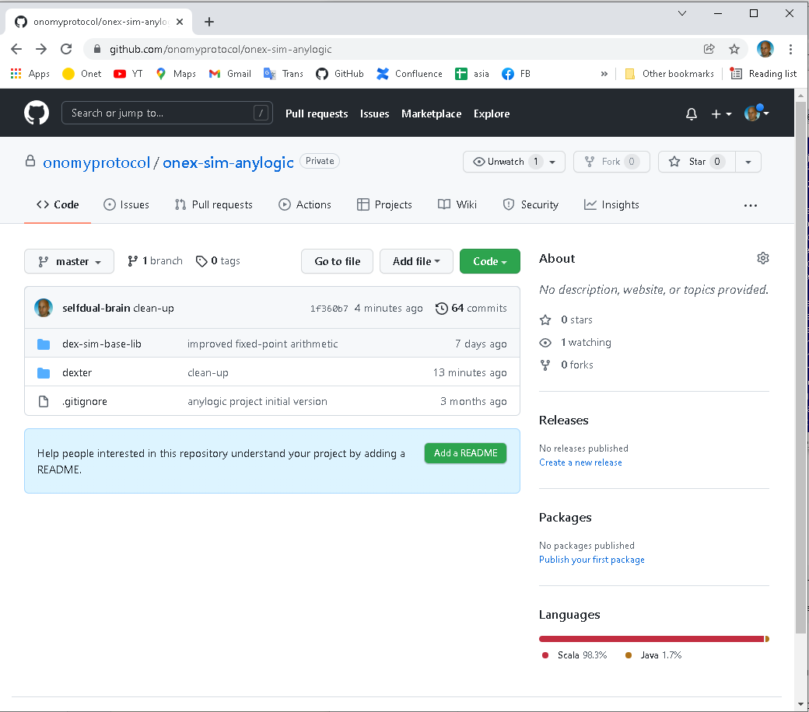
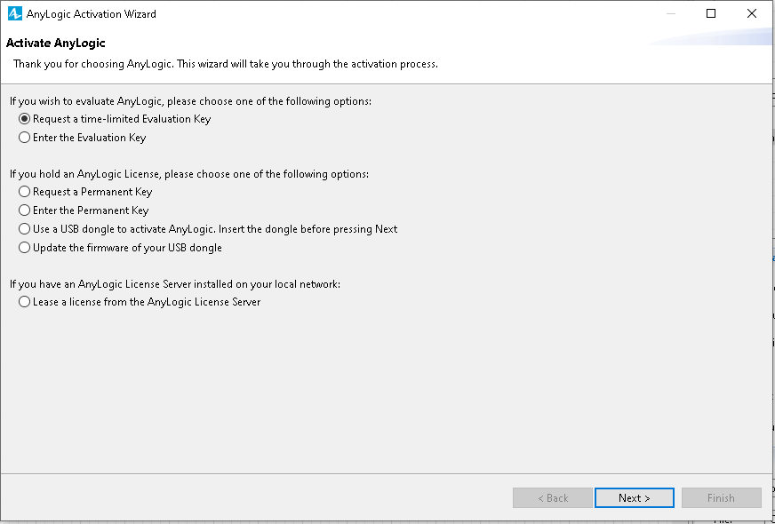
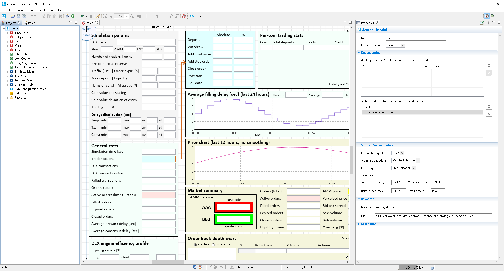
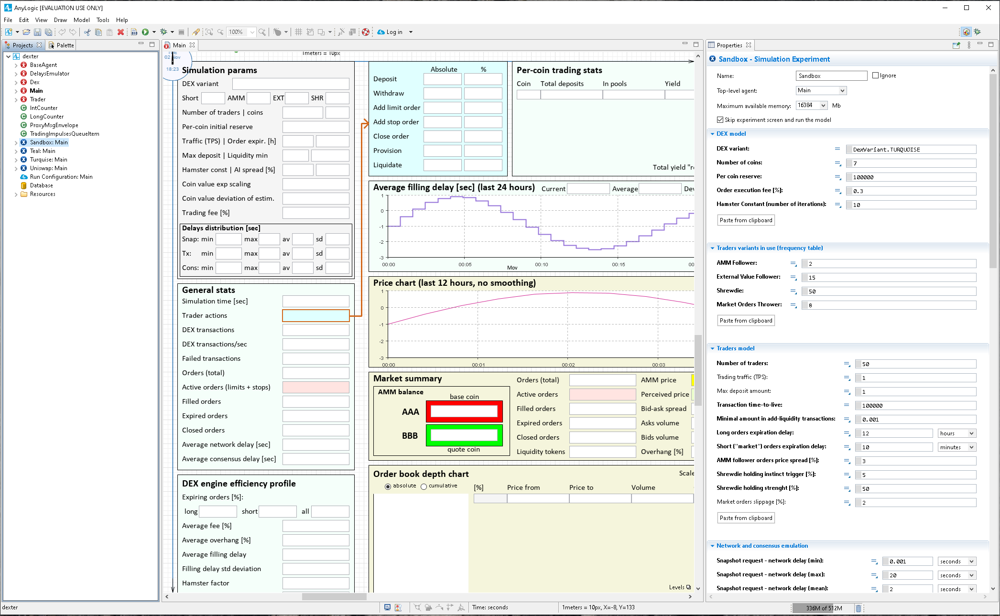
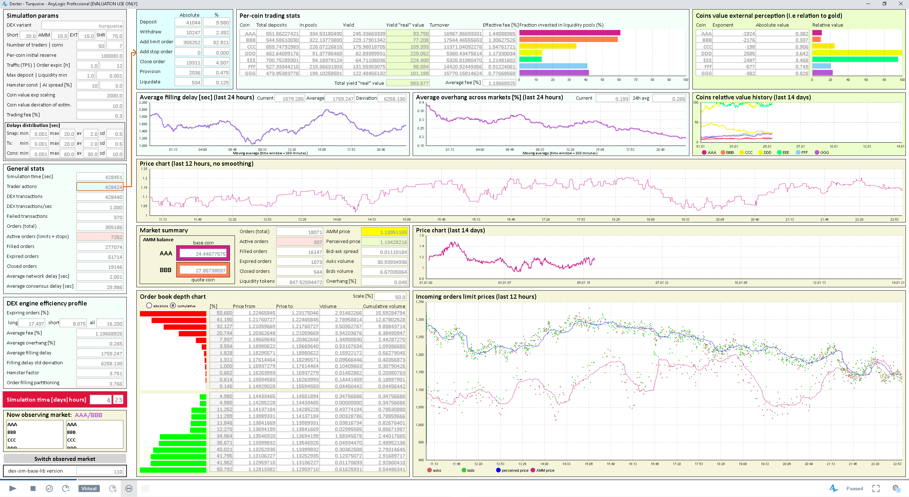

03. Quick start guide
=====================

In this chapter we summarize steps required to run Dexter on your computer.

Step 0: Supported platforms and hardware requirements
-----------------------------------------------------

Officially, Anylogic claims to be tested and supported on these platforms:

 - Microsoft Windows 10, x64, Internet Explorer 11
 - Apple macOS 12.0.1 (Monterey), Universal, Safari 9+
 - Ubuntu Linux 18 and 20, x64 (with installed GTK+, libwebkitgtk-1.0-0, libudev, libssl), Firefox 24+
 - Linux Mint 17, x64 (with installed GTK+, libwebkitgtk-1.0-0, libudev, libssl), Firefox 24+

According to our own testing, we had positive results on:

 - Windows 10
 - MacOS Bis Sur, running on Intel-based macbook

However testing on Linux revealed some severe problems (GUI crashing). Therefore we do not recommend running Dexter
on Linux.

The situation with M1-based Apple computers is also not clear (as of January 2022 java platform is not yet officially
supported on M1 Macs).

**Hardware requirements**

Dexter was developed and tested on a computer with the following capabilities:

 - 32GB of RAM
 - CPU computing power (as measured with Geekbench 5): single-core-score=597, multi-core-score=2346
 - display with resolution 2560x1440

Running Dexter on a machine with lower capabilities can be uncomfortable.

Caution: running really long simulations may require way bigger RAM amounts.

Step 1: Download Dexter
-----------------------

Go to this Github repository:

https://github.com/onomyprotocol/onex-sim-anylogic

Clone the repo (this step requires basic familiarity with GitHub interface). Then, find Dexter executables in **dexter**
directory. There are 2 files there:

 - ``dexter.alp`` - this is Anylogic "project" file of the simulator
 - ``lib/dex-sim-base-lib.jar`` - this is the library used by simulator

Step 2: Download and install Anylogic
-------------------------------------

Anylogic can be downloaded from manufacturer's website:

https://www.anylogic.com/downloads/

Pick the version compatible with your platform.

Dexter was tested on Anylogic version 8.7.9.

Step 3: Obtain Anylogic license
-------------------------------

Anylogic is a commercial product. You must purchase a license to run it.

Alternatively it can be run on evaluation license. Connecting the paid license or requesting the evaluation license
both are available inside the app - just launch Anylogic and then go to **Help\Activate product** in the main menu.

Step 4: Open Dexter project
---------------------------

1. Launch Anylogic.
2. Close the blue "welcome" window (check the "do not show this window in the future" checkbox).
3. Go to **File/Open** in the main menu.
4. Point to **dexter.alp** file downloaded in step 1.

Once the Dexter project is successfully opened in Anylogic, you should see this:

Step 5: Configure a simulation experiment
-----------------------------------------

In the project tree (left side of the window) find nodes with blue "X" icon. These are defined simulation experiments.
Selecting one of them (mouse click) will display the configuration of given experiment (visible in the rightmost pane):

Step 6: Run a simulation experiment
---------------------------------

Initially, there are 4 simulation experiments defined: Sandbox, Teal, Turquoise, Uniswap.
Right-clicking on an experiment brings a context menu with **Run** option (among others).

Starting an experiment will bring up a new window. This window is designed to be run full-screen (1440p or higher).

This is how a running simulation looks like:

