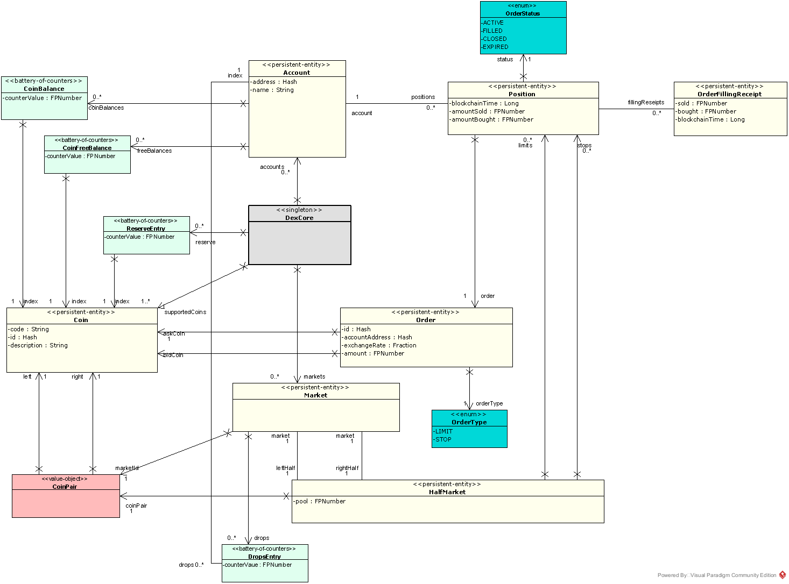

DEX model
=========

There is a general model of a DEX (derived from the TLA+ spec we mentioned before) which sits at the conceptual center
of Dexter design. On top of this, the piece of this model called "executor" is pluggable, so that comparative
simulation of various executors is possible.

In this chapter we describe this common base model, while the next chapter is devoted to the description of various
executors pre-installed in current version of Dexter.

Please notice that a DEX - as being deployed on a blockchain - has 4 conceptual "perspectives":

 1. End-user perspective: this covers the view of an end-user, so how the usage of the DEX looks like in practice; this would
    normally coincide with the GUI of the DEX client
 2. Client-api perspective: this covers the view of a client-developer; is is composed of APIs available to the DEX client
    software; this APIs may communicate to on-chain and off-chain components
 3  Blockchain perspective: this covers the view of a DEX developer and includes all the blockchain-specific solutions
    used to implement the DEX
 4  Abstract model perspective: this covers the internal working of a DEX, abstracting away from design choices specific
    to a given blockchain where the DEX will be deployed; in the implementation phase this model would typically be
    mapped to a smart-contract

Here we focus on the abstract model (i.e. perspective 4) exclusively. We make only a very basic assumptions about the
underlying blockchain.

Caution: Our goal in this chapter is to explain the DEX model as it exists in the simulator, not the DEX model to be
used in a production implementation of DEX (if any such implementation will happen to be created). In particular there
are several simplifications in place caused by the fact, that we do not simulate the actual blockchain. Rather the
blockchain functionality is mocked, and we only simulate some key characteristics of blockchain behaviour (like
consensus delays for example).

This UML diagram covers the whole model:

Built-in data types
-------------------

As Anylogic is based on Java, there are several data types we take as granted and we use them throughout this
documentation:

 - Int: the type of 32-bit signed integers
 - Long: the type of 64-bit signed integers
 - Boolean: the type of boolean values (true/false)
 - Double: the type of floating-point values

Arithmetic choices
------------------

We follow the TLA+ spec in arithmetic decisions:

 - fixed-point numbers are used for representing amounts of tokens (see ``FPNumber`` class)
 - fractions are used for representing prices (see ``Fraction`` class)

Representation of time
----------------------

Internally there are two notions of time in use:

 - **simulation time**: this is the time simulated by Anylogic engine, following the DES model of events queue; timepoints
   are represented as Double values and are interpreted as seconds
 - **blockchain time**: this the blockchain-implementation-specific "internal" time of a blockchain, represented as
   Long value

Blockchains in general do not have the idea of "real" time - this is due to the very nature of what a blockchain is.
However every blockchain has some notion of "internal" time-like concept, which corresponds to the chronology of
transactions execution, namely the following invariant holds:

  if transaction :math:`t_1` can see transaction :math:`t_2` in its past, then :math:`bTime(t_1)>bTime(t_2)`

Coins and tokens
----------------
wefwe

Coin pairs and normalization
----------------------------

fsds

Amounts and prices
------------------
fsds

Trader accounts
---------------

sdfsd

Reserve
-------

sdfsd

Markets
-------
fsdf

AMM
---

Orders
------

sfsd

Market orientation
------------------

sdf

Liquidity providers
-------------------

fsfs

Representation of an order book
-------------------------------
sfsd

Data stored in a trader account
-------------------------------
sfsd

