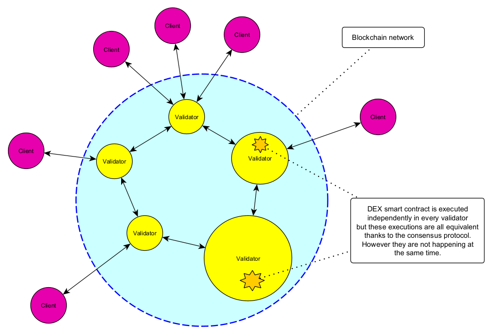
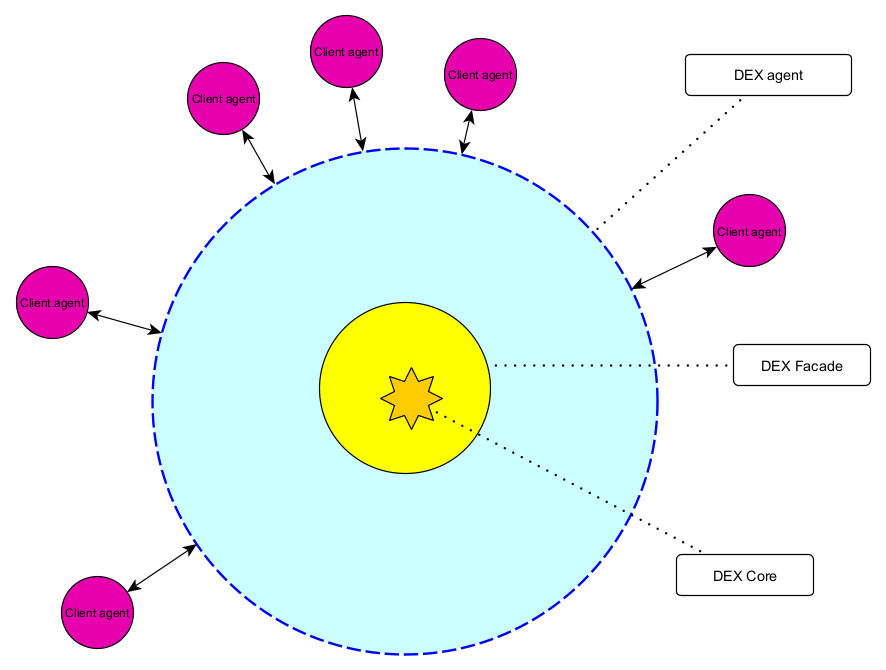

05. Blockchain model
====================

A DEX - as being deployed on a blockchain - has 4 conceptual "perspectives":

 1. End-user perspective: this covers the view of an end-user, so how the usage of the DEX looks like in practice; this
    would normally coincide with the GUI of the DEX client.
 2. Client-api perspective: this covers the view of a client-developer; is is composed of APIs available to the DEX client
    software; this APIs may communicate to on-chain and off-chain components
 3. Blockchain perspective: this covers the view of a DEX developer and includes all the blockchain-specific solutions.
    used to implement the DEX.
 4. Internal DEX model perspective: this covers the internal working of a DEX, abstracting away from design choices specific
    to a given blockchain where the DEX will be deployed; in the implementation phase this model would typically be
    mapped to a smart-contract.

Here we focus on the the way we mock blockchain architecture in the simulator. This covers perspectives (2) and (3).

Real blockchain vs blockchain mock
----------------------------------

A real blockchain is a P2P network of nodes (validators) building blocks and collectively running a consensus protocol
to come up with ever-growing sequence of blocks. The goal of underlying consensus protocol is to ensure that the
sequence of blocks - once established up to position N - is visible to every node as such (i.e. is "finalized") and
the sequence can never be changed.

Surrounding the network of validators is the (usually much larger) network of blockchain clients. Every blockchain
client picks (arbitrarily) some validator and uses it as a gateway to the blockchain. In theory this selection should
not influence the operation of a client, because all validators offer semantically equivalent API for clients.

For the purpose of DEX simulation we do not simulate the actual network of validators. Instead we just have a single
agent representing the blockchain, while clients are also represented as agents, and the communication between
agents and the blockchain is materialized as agent-to-agent message passing.

Caution: there are some additional agents involved in the design so to accommodate the simulation of network
communication between clients and the blockchain. Go to chapter 10 for more details on this.

Blockchain accounts
-------------------

A blockchain account is normally identified by a cryptographic public key (of public-private key pair). For the
purpose of the simulation we stripped cryptography and the account id is represented as a (randomly generated) hash
value.

Client-Blockchain communication protocol
----------------------------------------

There are two types of messages that a client can send to the blockchain:

 - transactions
 - queries

There is no response for a transaction.

On the other hand, queries follow request-response pattern.

Transactions
------------

A transaction has the following structure:

.. code:: scala

       creator: AccountAddress
       clientTime: SimulationTime
       ttl: BlockchainTime
       body: DexTransactionBody
       hash: Hash //plays the role of transaction id

A transaction gets executed and this execution changes the state of the blockchain computer.

Fields explained:

:creator: account address; the transaction will be executed on behalf of this account
:clientTime: real time of the client at the moment of sending this transaction
:ttl: latest blockchain time for this transaction; this transaction should not get executed at later blockchain time
:body: contains the "business-level" information, specific to transaction type (see below)
:hash: transaction id; in real life it would be the real hash of transaction binary representation, but we just mock
       this with randomly-generates hashes

Queries types
-------------

sfsd

