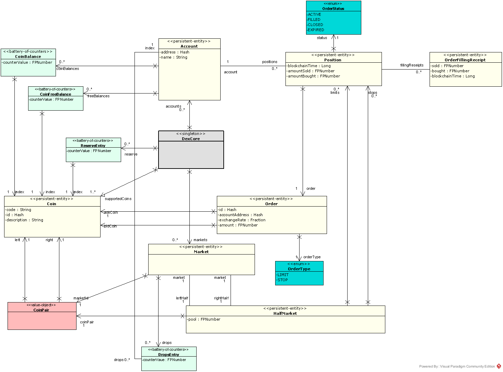
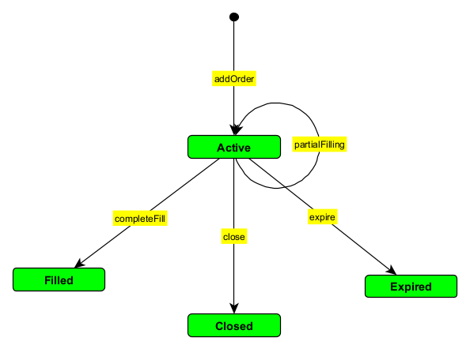
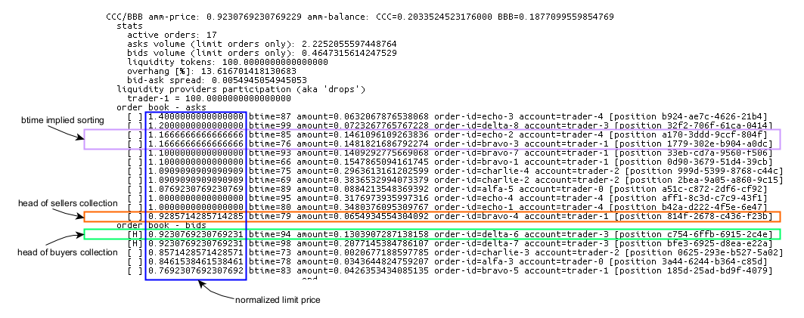
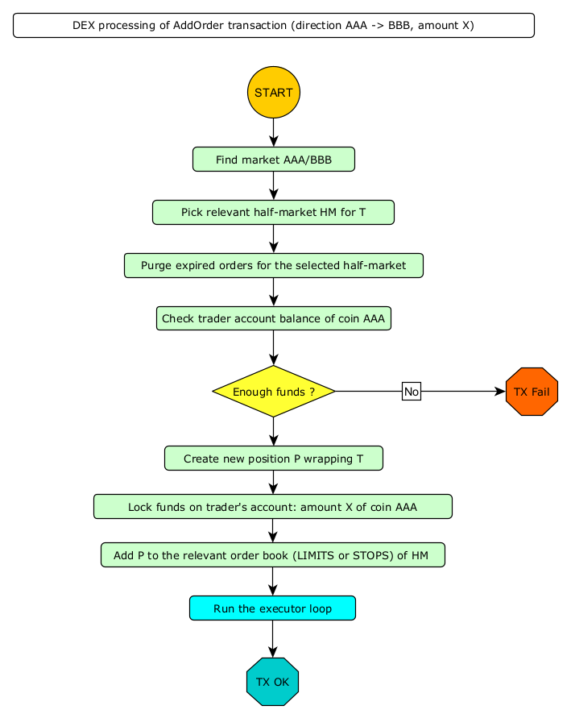

06. DEX model
=============

There is a general model of a DEX (derived from the TLA+ spec we mentioned before) which sits at the conceptual center
of Dexter design. Only one part of this model - the executor - is pluggable, so that comparative simulation of various
executors ca nbe achieved.

In this chapter we describe this common base model, while the next chapter is devoted to the various executors
pre-installed in the current version of Dexter.

This chapter covers perspective (4) according to the list of perspectives explained in chapter 5.

This UML diagram covers the whole model:

To illustrate the behaviour of DEX we use several examples written in Dexter scripting language. See chapter 15 for the
details on the syntax, semantics and how to run these scripts in Dexter command-line mode.

Coins and tokens
----------------

We use the term **coin** meaning "type of cryptocurrency". For example, in our lingo, BTC and ETH are coins. On the
other hand, we use the term **token** when we talk about amounts of coins. In practice: when I sell 1.305
bitcoins, we say that the the coin of that transaction is "bitcoin" and the number of tokens transferred is 1.305.

Coins are represented with ``Coin`` type, while token amounts are represented with ``FPNumber`` type.

We frequently need to talk about pairs of coins. When ``AAA`` and ``BBB`` are some coins, we want to be able to form
the pairs ``(AAA,BBB)`` and ``(BBB,AAA)``. This concept is represented with ``CoinPair`` type.

We also sometimes need 2-element coin sets. This is different than a coin pair, because a pair is ordered, while a set is
not. However, to keep things simpler, we represent a 2-element coin set as a **normalized coin pair**. This normalization
works as follows: because every coin has an id (hash), we consider a CoinPair to be **normalized** if coins in this
pair are ordered along their hashes.

Coins collection is automatically generated on simulation start.

**Example**

With number of coins configured to 7, at the beginning of the simulation the following information will show up in the
console:

.. code:: text

   coins in use:
     code=AAA id=ee93-992a-dbdd-6168 description=Sample coin AAA
     code=BBB id=9853-0e3b-6c5e-fd60 description=Sample coin BBB
     code=CCC id=aea4-0d22-8e88-7e5b description=Sample coin CCC
     code=DDD id=ba32-7373-3682-7484 description=Sample coin DDD
     code=EEE id=e999-5a44-0ea6-4d46 description=Sample coin EEE
     code=FFF id=1531-f159-e87b-6776 description=Sample coin FFF
     code=GGG id=a8f4-8174-5e0a-3c25 description=Sample coin GGG

These are automatically generated coins. For coins AAA and BBB, two coin pairs are possible: ``CoinPair(AAA,BBB)`` and
``CoinPair(BBB,AAA)``. Now let us look at the hashes. A hash is printed using hex encoding of corresponding byte array
and the comparison of hashes is lexicographic-per-byte. First byte of coin AAA identifier is ``ee`` in hex, which is
number 238. First byte of coin BBB identifier is ``98`` in hex, which is number 152. Hence, BBB has smaller hash than
AAA so we can conclude that ``CoinPair(BBB,AAA)`` is normalized and ``CoinPair(AAA, BBB)`` is not normalized.

DEX core
--------

``DexCore`` keeps all the information needed to process transactions generated by traders. It stands as a facade for
decentralized exchange operations (see :ref:`dex-operations-spec`). On top of this, ``DexCore`` calculates exchange
statistics (see chapter 12).

We also have ``DexFacade``, which plays the role of a more "high level" API to the DEX, while ``DexCore`` offers API
structure closer to the TLA+ spec.

Trader account
--------------

Trader account is just the same as blockchain account. DEX becomes aware of a trader account while executing the first
**deposit** operation for this account.

An account stores the following information:

 - current balance of tokens (per each coin)
 - current free balance of tokens (per each coin)
 - current balance of liquidity tokens (per market)
 - open positions

When a trader adds an order, the sell-coin amount gets locked so that it cannot be re-used in another order.

Reserve
-------

Reserve is the way we represent total tokens supply (per coin):

 - transferring tokens from reserve to trader account corresponds to "minting" tokens
 - transferring tokens from trader account to reserve corresponds to "burning" tokens

Reserve is represented as a battery-of-counters, indexed by coin.

The following DexFacade operations deal with reserve:

.. code:: scala

   class DexFacade {

     //Take a number of tokens (of specific coin) from the reserve and place it into an exchange account.
     def deposit(accountAddress: AccountAddress, accountName: String, amount: FPNumber, coin: Coin): Unit

     //Take a number of tokens (of specific coin) from specified trader account and return it to the reserve.
     def withdraw(accountAddress: AccountAddress, amount: FPNumber, coin: Coin): Unit

   }.

**Example**

The following scripts initializes trader accounts for 3 traders.

.. code:: text

  trader 00: deposit  11.234 AAA
  trader 01: deposit  5.01 AAA
  trader 01: deposit  1.203 BBB
  trader 02: deposit  0.099 CCC
  trader 00: withdraw 0.1 AAA
  trader 02: deposit  0.099 CCC

Caution: In this example (and all subsequent examples) we use per-coin initial reserve set to 1000.

After executing this script, the final state of the DEX will be:

.. code:: text

    -------------------------------- final state dump -----------------------------------------------
    per-coin stats
      AAA: reserve=983.8560000000000000 deposits=16.1440000000000000 in-pools=0.0000000000000000 yield=0.0000000000000000 turnover=0.0000000000000000 fee=0.0000000000000000
      BBB: reserve=998.7970000000000000 deposits=1.2030000000000000 in-pools=0.0000000000000000 yield=0.0000000000000000 turnover=0.0000000000000000 fee=0.0000000000000000
      CCC: reserve=999.8020000000000000 deposits=0.1980000000000000 in-pools=0.0000000000000000 yield=0.0000000000000000 turnover=0.0000000000000000 fee=0.0000000000000000
    accounts
      trader-0 (f03e-152a-9bcc-84a5)
        AAA: 11.1340000000000000 (free=11.1340000000000000 locked=0.0000000000000000)
      trader-1 (964c-867b-98d2-f9a5)
        BBB: 1.2030000000000000 (free=1.2030000000000000 locked=0.0000000000000000)
        AAA: 5.0100000000000000 (free=5.0100000000000000 locked=0.0000000000000000)
      trader-2 (7daa-7a83-0bc9-b98c)
        CCC: 0.1980000000000000 (free=0.1980000000000000 locked=0.0000000000000000)
    markets
    -------------------------------------- end ------------------------------------------------------

Markets
-------

DEX contains the collection of markets. For every normalized pair of coins we generate one market. This follows the
tradition of Forex: a market AAA/BBB is where coin AAA can be traded for BBB and coin BBB can be traded for AAA.

Hence, if we configure Dexter to simulate :math:`n` coins, :math:`\frac{n*(n-1)}{2}` markets will be generated.

We also borrow from Forex another naming convention: base/quote. Base is the coin we think of as being the "asset" and
quote is the coin we think of as being the "money". The selection of base is arbitrary - we just again use the
normalization of coin pairs here and in a normalized coin pair ``CoinPair(AAA,BBB)``, left-side coin (AAA in this example)
is base, while right-side coin (BBB in this example) is quote.

Base-quote convention is basically a way to pick some orientation of the market (which is otherwise fully symmetric),
hence talking about buyers, sellers and prices becomes unambiguous without further explanation of which coin we are
selling. With base/quote setup in place, whoever is selling the base coin is the seller, and whoever is buying the base
coin is the buyer. The price is then the amount of quote tokens to be paid for 1 base token.

A market maintains 4 ordered collections of orders:

  - limit orders (buyers collection)
  - limit orders (sellers collection)
  - stop orders (buyers collection)
  - stop orders (sellers collection)

Caution: stop orders are considered "experimental" feature and are not fully covered by this version of Dexter manual.

A market also contains a liquidity pool (also called "automated market maker" or AMM), which is a "locked" amount
of base tokens and quote tokens.

Liquidity pools
---------------

DEX-es we investigate are all based on so called "liquidity pools". A liquidity pool is just certain amount of tokens
kept as a "operational buffer" by the exchange. Thanks to the existence of such buffer, orders execution may be
achieved as trader-vs-pool transfers. This is in contrary to traditional exchanges (like Forex), where execution of
orders is achieved via matching sell-vs-buy orders, which leads to trader-vs-trader transfers.

A separate liquidity pool is attached to every market and technically has a form of two variables tracing the pool
balance - one variable for each coin on the market. See the variable ``HalfMarket.pool`` on DEX model above.

The accumulation of tokens in the liquidity pool is based on active participation of investors. Any trader can become
an investor in any liquidity pool by issuing "addLiquidity" transaction. The effect of this transaction will be
a donation of proportional amounts of both coins to the pool.

``Market.drops`` collection is the way DEX tracks participation of traders in given liquidity pool. Participation
tracking is based on a fictional "liquidity" coin (separate for every market), and drops is a collection keeping the
balance of liquidity coin per trader.

The following DexFacade operations deal with liquidity management:

.. code:: scala

   class DexFacade {

     //Initialize liquidity pool.
     def initAMM(account: AccountAddress, aCoin: Coin, bCoin: Coin, aCoinAmount: FPNumber, bCoinAmount: FPNumber): Boolean

     //Add liquidity to an already initialized pool.
     //Only one coin and its amount is provided as argument, the other side is automatically calculated
     def addLiquidity(accountAddress: AccountAddress, marketId: CoinPair, amountCoin: Coin, amount: FPNumber): Boolean

     //Burns specified amount of liquidity coins owned by specified trader account.
     //The trader will get proportional share of both coins of the liquidity pool.
     def withdrawLiquidity(account: AccountAddress, marketId: CoinPair, amountOfLiquidityCoinsToBurn: FPNumber): Boolean
   }

``InitAMM`` just allocates fixed amount of liquidity coins (100.0) as drops entry for the issuing trader.

``AddLiquidity`` increases investment of issuing trader into AMM of selected market. The algorithm here ensures that
the amounts of base and quote coin transferred from trader account will not change the current price. If
and :math:`ammQuote` are the initial balances of the AMM, and the trader adds liquidity by transferring :math:`x` tokens
of base coin and `y` tokens of quote coin, the DEX ensures that the following condition holds:

.. math::

  \frac{ammBase}{ammQuote}=\frac{ammBase+x}{ammQuote+y}

Let:

  - :math:`td` denote the total amount of liquidity tokens minted for the market under consideration
  - :math:`d` denote the amount of liquidity tokens DEX will mint in effect of ``AddLiquidity`` and add to the total
    balance of drops for the issuing trader account

``AddLiquidity`` mints liquidity tokens so that the following equation is satisfied:

.. math::

  \frac{x}{ammBase} = \frac{y}{ammQuote} = \frac{d}{td}

Caution: because of integer rounding, this equation usually cannot be satisfied exactly. DEX attempts to adhere
to this equation as much as the fixed-point arithmetic allows to.

Liquidity pool is the way we establish the concept of "current price" on the market: it is just the value
``ammQuote / ammBase``.

``WithdrawLiquidity`` burns specified amount of liquidity tokens. Let :math:`ammBase` and :math:`ammQuote` denote
current balance of the AMM for the relevant market. Let :math:`td` be the total number of liquidity tokens for this
market. Let  :math:`d` be the amount of liquidity tokens that a trader wants to burn. This will end up executing
the following token transfers from AMM to trader's account:

 - base coin: :math:`\frac{d}{td}*ammBase`
 - quote coin: :math:`\frac{d}{td}*ammQuote`

**Example**

In this example there are 3 traders, but 2 of them become liquidity providers.

.. code:: text

  trader 00: deposit  11.234 AAA
  trader 00: deposit  5.01 BBB
  trader 01: deposit  5.01 AAA
  trader 01: deposit  7.901 BBB
  trader 02: deposit  0.099 CCC
  trader 00: amm-init AAA=1.2 BBB=3.1
  trader 01: +amm AAA/BBB AAA=0.23
  trader 01: deposit  3.3 CCC
  trader 01: amm-init BBB=2 CCC=1.9

After executing this script, the final state of the DEX will be:

.. code:: text

    -------------------------------- final state dump -----------------------------------------------
    per-coin stats
      AAA: reserve=983.7560000000000000 deposits=16.2440000000000000 in-pools=1.4300000000000000 yield=0.0000000000000000 turnover=0.0000000000000000 fee=0.0000000000000000
      BBB: reserve=987.0890000000000000 deposits=12.9110000000000000 in-pools=5.6941666666666666 yield=0.0000000000000000 turnover=0.0000000000000000 fee=0.0000000000000000
      CCC: reserve=996.6010000000000000 deposits=3.3990000000000000 in-pools=1.9000000000000000 yield=0.0000000000000000 turnover=0.0000000000000000 fee=0.0000000000000000
    accounts
      trader-0 (6520-118d-99d3-651f)
        BBB: 1.9100000000000000 (free=1.9100000000000000 locked=0.0000000000000000)
        AAA: 10.0340000000000000 (free=10.0340000000000000 locked=0.0000000000000000)
      trader-1 (dd9d-dd30-e1fb-ebf6)
        BBB: 5.3068333333333334 (free=5.3068333333333334 locked=0.0000000000000000)
        AAA: 4.7800000000000000 (free=4.7800000000000000 locked=0.0000000000000000)
        CCC: 1.4000000000000000 (free=1.4000000000000000 locked=0.0000000000000000)
      trader-2 (aa15-a7ce-b653-fbb1)
        CCC: 0.0990000000000000 (free=0.0990000000000000 locked=0.0000000000000000)
    markets
      BBB/AAA amm-price: 0.3870967741935483 amm-balance: BBB=3.6941666666666666 AAA=1.4300000000000000
        stats
          active orders: 0
          asks volume (limit orders only): 0.0000000000000000
          bids volume (limit orders only): 0.0000000000000000
          liquidity tokens: 119.1666666666666666
          overhang [%]: 0.0
          bid-ask spread: 0.0000000000000000
        liquidity providers participation (aka 'drops')
          trader-1 = 19.1666666666666666
          trader-0 = 100.0000000000000000
        order book - asks
          limits
          stops
        order book - bids
          limits
          stops
      BBB/CCC amm-price: 0.9500000000000000 amm-balance: BBB=2.0000000000000000 CCC=1.9000000000000000
        stats
          active orders: 0
          asks volume (limit orders only): 0.0000000000000000
          bids volume (limit orders only): 0.0000000000000000
          liquidity tokens: 100.0000000000000000
          overhang [%]: 0.0
          bid-ask spread: 0.0000000000000000
        liquidity providers participation (aka 'drops')
          trader-1 = 100.0000000000000000
        order book - asks
          limits
          stops
        order book - bids
          limits
          stops
    -------------------------------------- end ------------------------------------------------------

Yield
-----

By **yield** we mean the profit made by a liquidity provider - as seen at some specified state of DEX. We formalize yield
as a value calculated separately for every <coin, market,trader> combination:

Let:

  - :math:`A` and :math:`B` be fixed coins
  - :math:`t` be fixed trader account
  - :math:`prov` be the sum of :math:`A` tokens added to the liquidity pool on the market :math:`<A,B>` by trader
    :math:`t` via **add-liquidity** operations (in the whole lifetime of DEX, up to the currently considered state)
  - :math:`liq` be the sum of :math:`A` tokens withdrawn from the liquidity pool on the market :math:`<A,B>` by trader
    :math:`t` via **remove-liquidity** operations (in the whole lifetime of DEX, up to the currently considered state)
  - :math:`a` and :math:`b` be balances of respectively :math:`A` and :math:`B` on the market :math:`<A,B>`
  - :math:`d` be the amount of liquidity tokens owned by trader :math:`t` on the market :math:`<A,B>`
  - :math:`td` be the total amount of liquidity tokens on the market :math:`<A,B>`

If at this moment trader :math:`t` decided to capitalize its share of the liquidity pool, it would be:

 - this amount of coin :math:`A`: :math:`\frac{d}{td}*a`
 - this amount of coin :math:`B`: :math:`\frac{d}{td}*b`

Let us focus on the overall coin :math:`A` balance as seen by the trader :math:`t` from the perspective of calculating
the profit/loss:

  - so far I invested :math:`prov` tokens into the pool
  - so far I withdrew :math:`liq` tokens from the pool
  - as of now :math:`\frac{d}{td}*a` tokens in the pool belongs to me

We define **yield** (per trader-market-coin combination) as: :math:`owned + withdrew - invested`, i.e:

.. math::

  yield_{tmc} = \frac{d}{td}*a + liq - prov

Yield can be summed over all markets, leading to the "yield per trader-coin combination", which has the form of
a function:

.. math::

  yield_{tc}: T \times C \rightarrow \mathcal{FP}

... where :math:`T` is the set of all trader accounts, :math:`C` is the set of all coins and :math:`\mathcal{FP}` are
fixed-point numbers.

Yield can be further summed over all traders, leading the "yield per coin" function:

.. math::

  yield_c: C \rightarrow \mathcal{FP}

This is exactly the yield listed in the **per-coin-stats** section (see the final state dump in examples).

Caution: please notice that yield can be negative.

Orders and positions
--------------------

An order represents a willing to trade. An order is prepared by a DEX client and is represented as an
immutable structure:

.. code:: scala

  case class Order(
      id: Hash,
      orderType: OrderType,
      accountAddress: AccountAddress,
      askCoin: Coin,
      bidCoin: Coin,
      exchangeRate: Fraction,
      amount: FPNumber,
      expirationTimepoint: SimulationTime,
      isShort: Boolean
  )

Fields explained:

:id:                  hash code of an order
:orderType:           ``OrderType.Limit`` or ``OrderType.Stop``
:accountAddress:      trader id
:askCoin:             coin which the trader wants to buy
:bidCoin:             coin which the trader wants to sell
:exchangeRate:        worst price the trader is going to accept for the execution of this order; if ``x`` tokens
                      is sold and ``y`` tokens is bought, the price is calculated as ``y/x`` and the invariant is
                      ``exchangeRate >= y/x``
:amount:              amount of sell bid coin that the trader wants to sell
:expirationTimepoint: timepoint when this order expires; we use real time here which is a quick-and-dirty hack,
                      because there is no precise notion of real time on a blockchain
:isShort:             a flag we use for simulation of pseudo-market-orders (see chapter 9)

During ``addOrder`` operation ``DexCore`` wraps an order within a ``Position`` instance. Position contains
transient/mutable processing information about an order.

.. code:: scala

  class Position(
                     order: Order,
                     market: Market,
                     account: Account,
                     blockchainTime: BlockchainTime, //blockchain time at the moment of adding the order
                     realTime: SimulationTime
                   ) extends Comparable[Position] {

    private var amountSold: FPNumber = FPNumber.zero
    private var amountBought: FPNumber = FPNumber.zero
    val fillingReceipts = new ArrayBuffer[OrderFillingReceipt]
    private var xStatus: OrderStatus = OrderStatus.Active
  )

Execution of an order is called **filling**. When ``AAA`` is the ask coin and ``BBB`` is the bid coin, we say that the
direction of this order is ``BBB -> AAA``, i.e. the trader wants to sell some amount of ``BBB`` coin and buy some
amount of ``AAA`` coin. This conversion may happen in one or more steps. Every such step is called a **swap**.
For a position ``P`` with direction ``BBB -> AAA``, the amount of tokens ``BBB`` sold so far is what we call
``amountFilled``. In general, an order will become completely filled when ``amountFilled = amount``.
It is the executor who runs the lifecycle of a position. Lifecycle of a position conforms to the following state machine:

As long as the position is **Active**, it is listed in the order book and is subject to further filling attempts.
When a position leaves **Active** state, no more swaps for this position will be performed.

**Example**

Caution: in command-line mode **expirationTimepoint** is mocked and **isShort** is always set to false.

In the following script there are 3 traders, and two orders are placed on the exchange - one LIMIT order in ``AAA/BBB``
market and one STOP order in ``AAA/CCC`` market.

.. code:: text

    trader 01: deposit  11.120 AAA
    trader 01: deposit  8.001 BBB
    trader 01: deposit  20.005 CCC
    trader 01: amm-init AAA=4.01 BBB=4.23
    trader 01: amm-init AAA=3.5 CCC=9.12
    trader 02: deposit  5.0 AAA
    trader 02: deposit  5.0 BBB
    trader 02: deposit  10.0 CCC
    trader 02: +amm     AAA/CCC AAA=2.2
    trader 01: open     #a01 AAA->BBB limit 1.0 [0.9]
    trader 02: open     #a02 AAA->CCC stop  1.52 [000.010]
    trader 01: close    #a01
    trader 01: +amm     AAA/BBB AAA=1.112
    trader 02: -amm     AAA/CCC 0.5

When executed with TEAL executor (see next chapter for the overview of supported executors), the execution log of this
script looks like this:

.. code:: text

    ---------------------------------- execution log ------------------------------------------------
    line 00001|trader 001: deposit  11.1200000000000000 AAA
      introduced trader 1: auto-generated account address=578d-8c40-a64f-6dec
      [btime 0] deposit: accountAddress=578d-8c40-a64f-6dec amount=11.1200000000000000 AAA
    line 00002|trader 001: deposit  8.0010000000000000 BBB
      [btime 1] deposit: accountAddress=578d-8c40-a64f-6dec amount=8.0010000000000000 BBB
    line 00003|trader 001: deposit  20.0050000000000000 CCC
      [btime 2] deposit: accountAddress=578d-8c40-a64f-6dec amount=20.0050000000000000 CCC
    line 00004|trader 001: amm-init AAA=4.0100000000000000 BBB=4.2300000000000000
      [btime 3] provision: accountAddress=578d-8c40-a64f-6dec aAmount=4.0100000000000000 AAA bAmount=4.2300000000000000 BBB drop=100.0000000000000000
    line 00005|trader 001: amm-init AAA=3.5000000000000000 CCC=9.1200000000000000
      [btime 4] provision: accountAddress=578d-8c40-a64f-6dec aAmount=3.5000000000000000 AAA bAmount=9.1200000000000000 CCC drop=100.0000000000000000
    line 00006|trader 002: deposit  5.0000000000000000 AAA
      introduced trader 2: auto-generated account address=bb8b-4f43-cd02-af10
      [btime 5] deposit: accountAddress=bb8b-4f43-cd02-af10 amount=5.0000000000000000 AAA
    line 00007|trader 002: deposit  5.0000000000000000 BBB
      [btime 6] deposit: accountAddress=bb8b-4f43-cd02-af10 amount=5.0000000000000000 BBB
    line 00008|trader 002: deposit  10.0000000000000000 CCC
      [btime 7] deposit: accountAddress=bb8b-4f43-cd02-af10 amount=10.0000000000000000 CCC
    line 00009|trader 002: +amm     AAA/CCC AAA=2.2000000000000000
      [btime 8] provision: accountAddress=bb8b-4f43-cd02-af10 aAmount=2.2000000000000000 AAA bAmount=5.7325714285714285 CCC drop=62.8571428571428571
    line 00010|trader 001: open     #a01 AAA->BBB limit 1.0000000000000000 [0.9000000000000000]
      [btime 9] [rtime 2.0] open order: id=5bf7-082e-6fce-6801 type=Limit account=578d-8c40-a64f-6dec askCoin=BBB bidCoin=AAA price=9/10 amount=1.0000000000000000 exptime=259201.0
      [btime 9] [rtime 4.0] created new position for order 5bf7-082e-6fce-6801 normalized-amount=1.0000000000000000
      limit-execute: askCoin=BBB bidCoin=AAA
      limit-execute decision: partial filling of Position(Order(5bf7-082e-6fce-6801,Limit,578d-8c40-a64f-6dec,BBB,AAA,9/10,1.0000000000000000,259201.0,false),Market[AAA/BBB],Account-578d-8c40-a64f-6dec,9,3.0)
      old-normalized-amount=1.0000000000000000 new-normalized-amount=0.6731578947368422 delta=0.3268421052631578
      partial-filling [position 5bf7-082e-6fce-6801] (0.3268421052631578 AAA) ~~~~> (0.2941578947368420 BBB)
    line 00011|trader 002: open     #a02 AAA->CCC stop 1.5200000000000000 [0.0100000000000000]
      [btime 10] [rtime 8.0] open order: id=51d9-58c4-4514-157a type=Stop account=bb8b-4f43-cd02-af10 askCoin=AAA bidCoin=CCC price=1/100 amount=1.5200000000000000 exptime=259207.0
      [btime 10] [rtime 10.0] created new position for order 51d9-58c4-4514-157a normalized-amount=0.0152000000000000
      stop-execute: askCoin=AAA bidCoin=CCC
    line 00012|trader 001: close    #a01
      [btime 11] close: askCoin=BBB bidCoin=AAA position=5bf7-082e-6fce-6801
    line 00013|trader 001: +amm     AAA/BBB AAA=1.1120000000000000
      [btime 12] provision: accountAddress=578d-8c40-a64f-6dec aAmount=1.1120000000000000 AAA bAmount=1.0091804854368932 BBB drop=25.6407766990291267
    line 00014|trader 002: -amm     AAA/CCC 0.5000000000000000
      [btime 13] liquidate: accountAddress=bb8b-4f43-cd02-af10 aAmount=0.0175000000000000 AAA bAmount=0.0455999999999999 CCC drop=0.5000000000000000

After execution, the final state of the DEX will be:

.. code:: text

    -------------------------------- final state dump -----------------------------------------------
    per-coin stats
      AAA: reserve=983.8800000000000000 deposits=16.1200000000000000 in-pools=11.1313421052631578 yield=0.3268421052631578 turnover=0.3268421052631578 fee=100.0000000000000000
      BBB: reserve=986.9990000000000000 deposits=13.0010000000000000 in-pools=4.9450225907000512 yield=-0.2941578947368420 turnover=0.2941578947368420 fee=-100.0000000000000000
      CCC: reserve=969.9950000000000000 deposits=30.0050000000000000 in-pools=14.8069714285714286 yield=0.0000000000000000 turnover=0.0000000000000000 fee=0.0000000000000000
    accounts
      trader-1 (578d-8c40-a64f-6dec)
        AAA: 2.1711578947368422 (free=2.1711578947368422 locked=0.0000000000000000)
        CCC: 10.8850000000000000 (free=10.8850000000000000 locked=0.0000000000000000)
        BBB: 3.0559774092999488 (free=3.0559774092999488 locked=0.0000000000000000)
      trader-2 (bb8b-4f43-cd02-af10)
        AAA: 2.8175000000000000 (free=2.8175000000000000 locked=0.0000000000000000)
        CCC: 4.3130285714285714 (free=2.7930285714285714 locked=1.5200000000000000)
        BBB: 5.0000000000000000 (free=5.0000000000000000 locked=0.0000000000000000)
        [>] a02 [btime 10 position 51d9-58c4-4514-157a] CCC->AAA Stop initial-amount 1.5200000000000000 limit-price 0.0100000000000000 outstanding-amount 1.5200000000000000 bought/sold 0.0 sold/bought 0.0
    markets
      AAA/BBB amm-price: 0.9075364077669903 amm-balance: AAA=5.4488421052631578 BBB=4.9450225907000512
        stats
          active orders: 0
          asks volume (limit orders only): 0.0000000000000000
          bids volume (limit orders only): 0.0000000000000000
          liquidity tokens: 125.6407766990291267
          overhang [%]: 0.0
          bid-ask spread: 0.0000000000000000
        liquidity providers participation (aka 'drops')
          trader-1 = 125.6407766990291267
        order book - asks
          limits
          stops
        order book - bids
          limits
          stops
      AAA/CCC amm-price: 2.6057142857142857 amm-balance: AAA=5.6825000000000000 CCC=14.8069714285714286
        stats
          active orders: 1
          asks volume (limit orders only): 0.0000000000000000
          bids volume (limit orders only): 0.0000000000000000
          liquidity tokens: 162.3571428571428571
          overhang [%]: 0.0
          bid-ask spread: 0.0000000000000000
        liquidity providers participation (aka 'drops')
          trader-2 = 62.3571428571428571
          trader-1 = 100.0000000000000000
        order book - asks
          limits
          stops
        order book - bids
          limits
          stops
            [ ] 100.0000000000000000 btime=10 amount=1.5200000000000000 order-id=a02 account=trader-2 [position 51d9-58c4-4514-157a]
    -------------------------------------- end ------------------------------------------------------

Representation of an order book
-------------------------------

An order book is represented as a sorted sequence of positions. Sorting is based on compound key:
``(order.exchangeRate, position.blockchainTime)``. In a normalized view of the market, the sorting is different
for sellers and b

**Example**

This is a dump of a market state obtained by running Dexter in command-line mode (see chapter 15 for more details
on command-line mode).

.. code:: text

  CCC/BBB amm-price: 0.9230769230769229 amm-balance: CCC=0.2033524523176000 BBB=0.1877099559854769
    stats
      active orders: 17
      asks volume (limit orders only): 2.2252055597448764
      bids volume (limit orders only): 0.4647315614247529
      liquidity tokens: 100.0000000000000000
      overhang [%]: 13.616701418130683
      bid-ask spread: 0.0054945054945053
    liquidity providers participation (aka 'drops')
      trader-1 = 100.0000000000000000
    order book - asks
      [ ] 1.4000000000000000 btime=87 amount=0.0632067876538068 order-id=echo-3 account=trader-4 [position b924-ae7c-4626-21b4]
      [ ] 1.2000000000000000 btime=99 amount=0.0723267765767228 order-id=delta-8 account=trader-3 [position 32f2-706f-61ca-0414]
      [ ] 1.1666666666666666 btime=85 amount=0.1461096109263836 order-id=echo-2 account=trader-4 [position a170-3ddd-9ccf-804f]
      [ ] 1.1666666666666666 btime=76 amount=0.1481821686792274 order-id=bravo-3 account=trader-1 [position 1779-302e-b904-a0dc]
      [ ] 1.1000000000000000 btime=93 amount=0.1409292775669068 order-id=bravo-7 account=trader-1 [position 33eb-cd7a-9560-f506]
      [ ] 1.1000000000000000 btime=66 amount=0.1547865094161745 order-id=bravo-1 account=trader-1 [position 0d90-3679-51d4-39cb]
      [ ] 1.0909090909090909 btime=75 amount=0.2963613161202599 order-id=charlie-4 account=trader-2 [position 999d-5399-8768-c44c]
      [ ] 1.0909090909090909 btime=69 amount=0.3836532994073379 order-id=charlie-2 account=trader-2 [position 2bea-9a05-a860-9c15]
      [ ] 1.0769230769230769 btime=89 amount=0.0884213548369392 order-id=alfa-5 account=trader-0 [position a51c-c872-2df6-cf92]
      [ ] 1.0000000000000000 btime=95 amount=0.3176973935997316 order-id=echo-4 account=trader-4 [position aff1-8c3d-c7c9-43f1]
      [ ] 1.0000000000000000 btime=80 amount=0.3480376095309767 order-id=echo-1 account=trader-4 [position b42a-d222-4f5e-6e47]
      [ ] 0.9285714285714285 btime=79 amount=0.0654934554304092 order-id=bravo-4 account=trader-1 [position 814f-2678-c436-f23b]
    order book - bids
      [H] 0.9230769230769231 btime=94 amount=0.1303907287138158 order-id=delta-6 account=trader-3 [position c754-6ffb-6915-2c4e]
      [H] 0.9230769230769231 btime=98 amount=0.2077145384786107 order-id=delta-7 account=trader-3 [position bfe3-6925-d8ea-e22a]
      [ ] 0.8571428571428571 btime=73 amount=0.0020677188597785 order-id=charlie-3 account=trader-2 [position 0625-293e-b527-5a02]
      [ ] 0.8461538461538461 btime=78 amount=0.0343644824759207 order-id=alfa-3 account=trader-0 [position 3a44-6244-b364-c85d]
      [ ] 0.7692307692307692 btime=83 amount=0.0426353434085135 order-id=bravo-5 account=trader-1 [position 185d-25ad-bd9f-4079]

The market is presented in the normalized view. Order book is presented in a way similar to depth chart. Ordering of
positions sequence corresponds to execution priority.Head of positions sequence for ask (sellers) is marked with red
border. Head of positions sequence for bid (buyers) is marked with green border.Purple border highlights a situation
where the limit price was the same for two positions and therefore the blockchain time decided about the priority.
Smaller btime value means older position (because this is the blockchain time at registering that order).

.. _dex-operations-spec:

Execution of orders
-------------------

The following sequence diagram illustrates the general algorithm of processing new orders on a DEX. Several technical details
(such as updating various statistics) are stripped.

**Executor loop** is the pluggable part of this algorithm. Current version of Dexter supports 3 executors (more can be added
in the future). The next chapter is devoted to specify internals of all currently supported executors.

Summary of "price" concepts across Dexter
-----------------------------------------

"Exchange rate" aka "price" seems to be a well known concept: if the price of bitcoin is 40 kUSD then I will need to
pay 120 kUSD for 3 bitcoins. However, because of the symmetry, one could be interested in the dual point of view - the
price of 1 dollar is 0.000025 bitcoin. Therefore we need to introduce **price direction**: for coins :math:`AAA` and
:math:`BBB`, we say that price in direction :math:`AAA \rightarrow BBB` is the following fraction:

.. math::

    \frac{tokens AAA paid}{tokens BBB received}

... where tokens paid and received corresponds to an imaginary, infinitely small swap to be executed.

However, things get more complex when we apply this intuition to our DEX model and more generally to the inner working
of Dexter. It turns our that there are 5 different concepts of "price" in Dexter. We enumerate all these concepts below.

For keeping the notation coherent, we assume that we are talking about a market with two coins :math:`AAA`
and :math:`BBB` and the price direction considered is :math:`AAA \rightarrow BBB`.

**AMM price**
  This is a market-level value. It reflects the official price as displayed for given market. It is derived from the
  current balance of the liquidity pool attached to this market. The exact formula is:
  :math:`\frac{balanceAAA}{balanceBBB}`.

**Perceived price**
  This is a market-level value. It reflects the price derived from the "external value" of coins. See chapter 8 for
  a detailed explanation of the external value model.

**Swap price**
  This is a swap-level value. Every swap represents an "atomic" exchange of tokens. As a swap means an already
  executed conversion of tokens, we know the amounts obtained and sold. The way swap price is calculated of course
  depends on the direction of the order, which the swap belongs to.  For example for an order with direction
  :math:`AAA \rightarrow BBB`, the price in direction :math:`AAA \rightarrow BBB` is calculated as
  :math:`\frac{tokens AAA sold}{tokens BBB obtained}.

**Achieved price**
  This is an order-level value. It corresponds to the average price achieved so far in the history of execution of
  given order. The way achieved price is calculated depends on the direction of the order vs the direction of the price.
  As we want tho calculate the price in direction  :math:`AAA \rightarrow BBB`, this works as follows:
. for an order with direction :math:`AAA \rightarrow BBB` achieved price is
  :math:`\frac{tokens AAA sold so far}{tokens BBB obtained so far}. For an order with direction :math:`BBB \rightarrow AAA`
  (so, opposite to price direction) achieved price is :math:`\frac{tokens AAA obtained so far}{tokens BBB sold so far} /geq LP`.

**Limit price**
  This is an order-level value. On creating an order, a trader defines the worst price he is willing to accept for
  executing given order. During the whole lifetime of an order :math:`P`:, the following condition must
  hold: :math:`AP(P) <= LP(P)`, where :math:`AP(P)` is the achieved price for :math:`P` calculated in the same direction
  as the direction of :math:`P`, and :math:`LP(P)` is same-direction limit price for :math:`P`.

