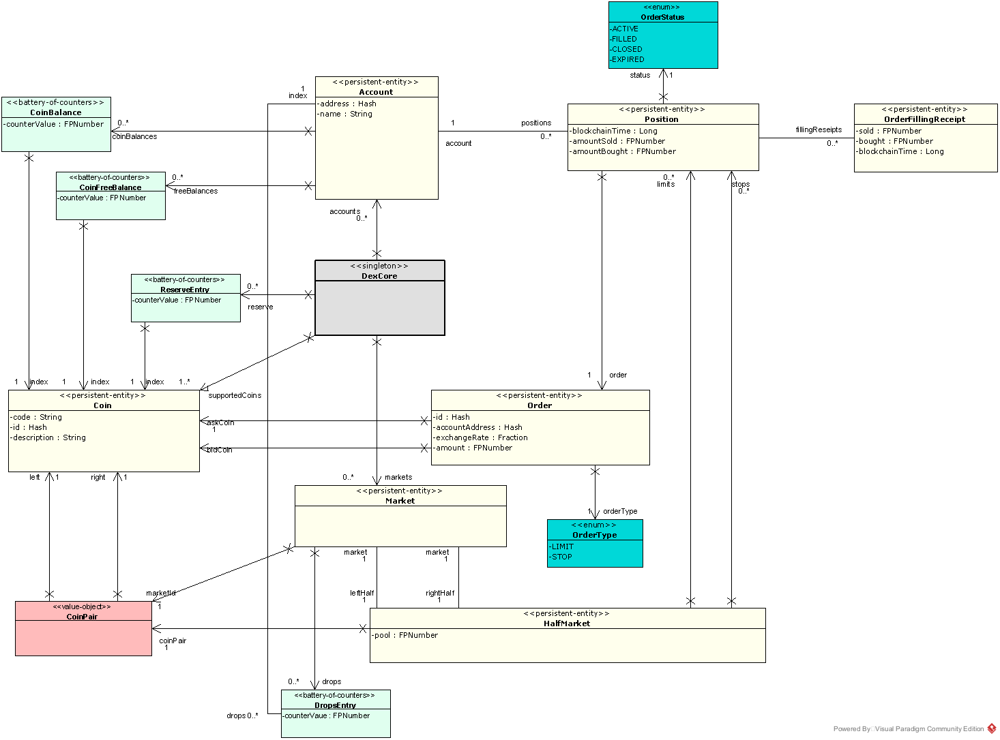

DEX model
=========

There is a general model of a DEX (derived from the TLA+ spec we mentioned before) which sits at the conceptual center
of Dexter design. Only one part of this model - the executor - is pluggable, so that comparative simulation of various
executors ca nbe achieved.

In this chapter we describe this common base model, while the next chapter is devoted to the various executors
pre-installed in the current version of Dexter.

This chapter covers perspective (4) according to the list of perspectives explained in chapter 5.

**Caution:** Our goal in this chapter is to explain the DEX model as it exists in the simulator, not the DEX model to be
used in a production implementation of DEX (if any such implementation will happen to be created). In particular there
are several simplifications in place caused by the fact, that we do not simulate the actual blockchain. Rather the
blockchain functionality is mocked, and we only simulate some key characteristics of blockchain behaviour (like
consensus delays for example).

This UML diagram covers the whole model:

Data types
----------

Client <-> Blockchain communication model
-----------------------------------------

Coins and tokens
----------------

We use the term **coin** meaning "type of cryptocurrency". In our lingo, BTC and ETH are coins. On the other hand,
we use the term **token** when we talk about amounts of coins transferred or wanted. In practice: when I sold 1.305
bitcoins, we say that the the coin of that transaction was "bitcoin" and the number of tokens transferred was 1.305.

Coins are represented with ``Coin`` type, while token amounts are represented with ``FPNumber`` type.

We frequently need to talk about pairs of coins. When ``AAA`` and ``BBB`` are some coins, we want to be able to form
the pairs ``(AAA,BBB)`` and ``(BBB,AAA)``. This concept is represented with ``CoinPair`` type.

We also sometimes need 2-element coin sets. This is different than coin pair, because a pair is ordered, while a set is
not. However, to keep things simpler, we represent 2-element coin set as a **normalized coin pair**. This normalization
works as follows: because every coin has an id (hash), we consider a CoinPair to be **normalized** if coins in this
pair are ordered along their hashes.

DEX core
--------

sfsd

Trader accounts
---------------

We assume trader account is just the same as blockchain account. DEX becomes aware of a trader account while executing
first **deposit** operation for this account.

An account stores the following information:

 - current balance of tokens (per each coin)
 - current free balance of tokens (per each coin)
 - current balance of liquidity tokens (per market)
 - opened positions

Reserve
-------

Reserve is the way we represent total tokens supply (per coin). Money

Markets
-------
fsdf

AMM
---

Orders
------

sfsd

Market orientation
------------------

sdf

Liquidity providers
-------------------

fsfs

Representation of an order book
-------------------------------
sfsd

Data stored in a trader account
-------------------------------
sfsd

Execution of orders
-------------------

