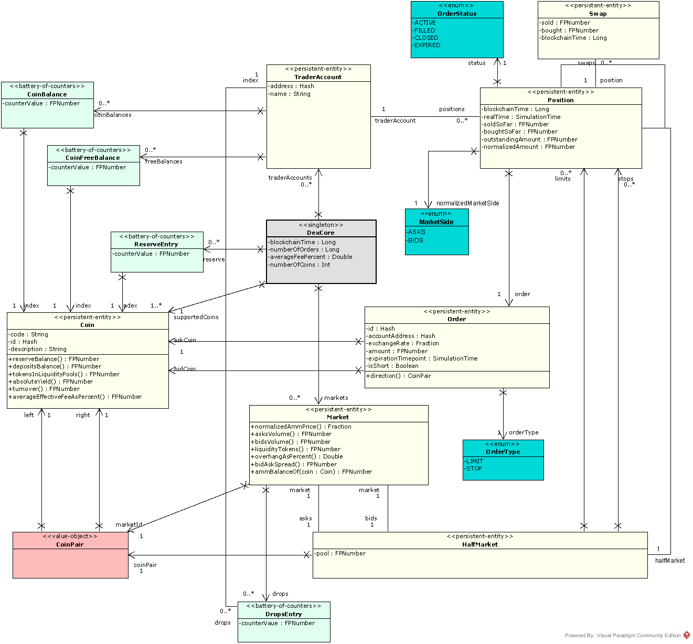
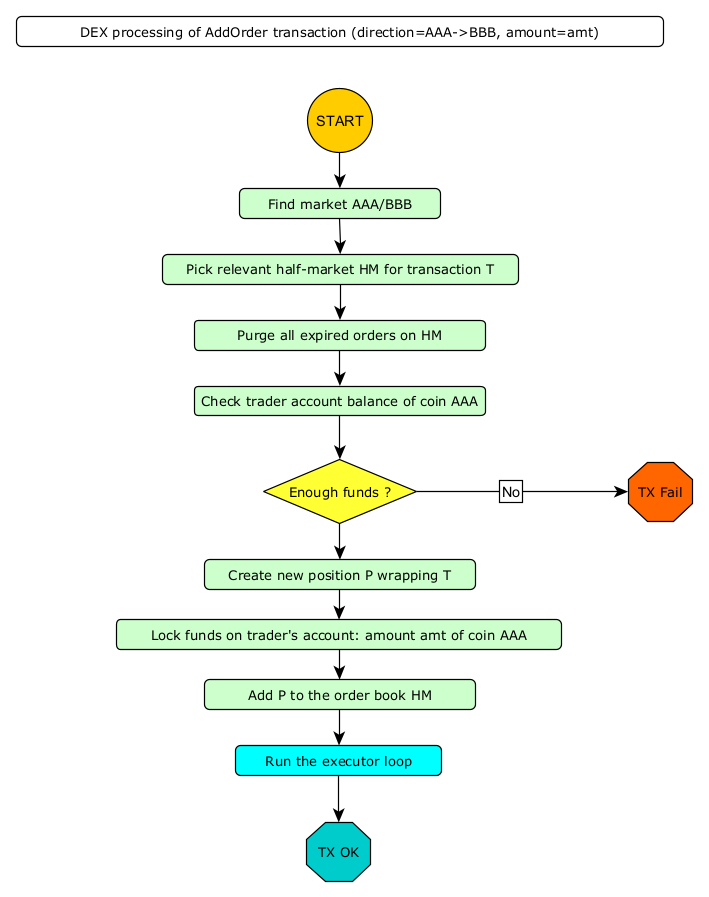

06. DEX model
=============

There is a general model of a DEX (derived from the TLA+ spec we mentioned before) which sits at the conceptual center
of Dexter design. Only one part of this model - the executor - is pluggable, so that comparative simulation of various
executors ca nbe achieved.

In this chapter we describe this common base model, while the next chapter is devoted to the various executors
pre-installed in the current version of Dexter.

This chapter covers perspective (4) according to the list of perspectives explained in chapter 5.

This UML diagram covers the whole model:

To illustrate the behaviour of DEX we use several examples written in Dexter scripting language. See chapter 15 for the
details on the syntax, semantics and how to run these scripts in Dexter command-line mode.

Coins and tokens
----------------

We use the term **coin** meaning "type of cryptocurrency". For example, in our lingo, BTC and ETH are coins. On the
other hand, we use the term **token** when we talk about amounts of coins. In practice: when I sell 1.305
bitcoins, we say that the the coin of that transaction is "bitcoin" and the number of tokens transferred is 1.305.

Coins are represented with ``Coin`` type, while token amounts are represented with ``FPNumber`` type.

We frequently need to talk about pairs of coins. When ``AAA`` and ``BBB`` are some coins, we want to be able to form
the pairs ``(AAA,BBB)`` and ``(BBB,AAA)``. This concept is represented with ``CoinPair`` type.

We also sometimes need 2-element coin sets. This is different than a coin pair, because a pair is ordered, while a set is
not. However, to keep things simpler, we represent a 2-element coin set as a **normalized coin pair**. This normalization
works as follows: because every coin has an id (hash), we consider a CoinPair to be **normalized** if coins in this
pair are ordered along their hashes.

Coins collection is automatically generated on simulation start.

**Example**

With number of coins configured to 7, at the beginning of the simulation the following information will show up in the
console:

.. code:: text

   coins in use:
     code=AAA id=ee93-992a-dbdd-6168 description=Sample coin AAA
     code=BBB id=9853-0e3b-6c5e-fd60 description=Sample coin BBB
     code=CCC id=aea4-0d22-8e88-7e5b description=Sample coin CCC
     code=DDD id=ba32-7373-3682-7484 description=Sample coin DDD
     code=EEE id=e999-5a44-0ea6-4d46 description=Sample coin EEE
     code=FFF id=1531-f159-e87b-6776 description=Sample coin FFF
     code=GGG id=a8f4-8174-5e0a-3c25 description=Sample coin GGG

These are automatically generated coins. For coins AAA and BBB, two coin pairs are possible: ``CoinPair(AAA,BBB)`` and
``CoinPair(BBB,AAA)``. Now let us look at the hashes. A hash is printed using hex encoding of corresponding byte array
and the comparison of hashes is lexicographic-per-byte. First byte of coin AAA identifier is ``ee`` in hex, which is
number 238. First byte of coin BBB identifier is ``98`` in hex, which is number 152. Hence, BBB has smaller hash than
AAA so we can conclude that ``CoinPair(BBB,AAA)`` is normalized and ``CoinPair(AAA, BBB)`` is not normalized.

DEX core
--------

``DexCore`` keeps all the information needed to process transactions generated by traders:

  - coins
  - reserve state
  - all trader accounts
  - markets

``DexCore`` stands as a facade for decentralized exchange operations (see :ref:`dex-operations-spec`).

On top of this, ``DexCore`` calculates exchange statistics. We describe all simulation statistics in chapter 12.

We also have ``DexFacade``, which plays the role of a more "high level" API to the DEX, while ``DexCore`` offers API
structure closer to the TLA+ spec.

Trader accounts
---------------

Trader account is just the same as blockchain account. DEX becomes aware of a trader account while executing the first
**deposit** operation for this account.

An account stores the following information:

 - current balance of tokens (per each coin)
 - current free balance of tokens (per each coin)
 - current balance of liquidity tokens (per market)
 - opened positions

When a trader adds an order, the sell-coin amount gets locked so that it cannot be re-used in another order.

Reserve
-------

Reserve is the way we represent total tokens supply (per coin):

 - transferring tokens from reserve to trader account corresponds to "minting" tokens
 - transferring tokens from trader account to reserve corresponds to "burning" tokens

Reserve is represented as a battery-of-counters, indexed by coin.

The following DexFacade operations deal with reserve:

.. code:: scala

   class DexFacade {

     //Take a number of tokens (of specific coin) from the reserve and place it into an exchange account.
     def deposit(accountAddress: AccountAddress, accountName: String, amount: FPNumber, coin: Coin): Unit

     //Take a number of tokens (of specific coin) from specified trader account and return it to the reserve.
     def withdraw(accountAddress: AccountAddress, amount: FPNumber, coin: Coin): Unit

   }.

**Example**

The following scripts initializes trader accounts for 3 traders.

.. code:: text

  trader 00: deposit  11.234 AAA
  trader 01: deposit  5.01 AAA
  trader 01: deposit  1.203 BBB
  trader 02: deposit  0.099 CCC
  trader 00: withdraw 0.1 AAA
  trader 02: deposit  0.099 CCC

After executing this script, the final state of the DEX will be:

.. code:: text

  -------------------------------- final state dump -----------------------------------------------
  reserve
    AAA: 983.8560000000000000
    BBB: 998.7970000000000000
    CCC: 999.8020000000000000
  accounts
    trader-0 (3c31-5dc9-534d-b125)
      AAA: 11.1340000000000000 (free=11.1340000000000000 locked=0.0000000000000000)
    trader-1 (4db5-f1f9-991e-59ef)
      AAA: 5.0100000000000000 (free=5.0100000000000000 locked=0.0000000000000000)
      BBB: 1.2030000000000000 (free=1.2030000000000000 locked=0.0000000000000000)
    trader-2 (58c4-2c6d-2bc9-5dea)
      CCC: 0.1980000000000000 (free=0.1980000000000000 locked=0.0000000000000000)
  markets
-------------------------------------- end ------------------------------------------------------

Markets
-------

DEX contains the collection of markets. For every normalized pair of coins we generate one market. This follows the
tradition of Forex: a market AAA/BBB is where coin AAA can be traded for BBB and coin BBB can be traded for AAA.

Hence, if we configure Dexter to simulate :math:`n` coins, :math:`\frac{n*(n-1)}{2}` markets will be generated.

We also borrow from Forex another naming convention: base/quote. Base is the coin we think of as being the "asset" and
quote is the coin we think of as being the "money". The selection of base is arbitrary - we just again use the
normalization of coin pairs here and in a normalized coin pair ``CoinPair(AAA,BBB)``, left-side coin (AAA in this example)
is base, while right-side coin (BBB in this example) is quote.

Base-quote convention is basically a way to pick some orientation of the market (which is otherwise fully symmetric),
hence talking about buyers, sellers and prices becomes unambiguous without further explanation of which coin we are
selling. With base/quote setup in place, whoever is selling the base coin is the seller, and whoever is buying the base
coin is the buyer. The price is then the amount of quote tokens to be paid for 1 base token.

A market maintains 4 ordered collections of orders:

  - limit orders (buyers collection)
  - limit orders (sellers collection)
  - stop orders (buyers collection)
  - stop orders (sellers collection)

Caution: stop orders are considered "experimental" feature and are not fully covered by this version of Dexter manual.

A market also contains a liquidity pool (also called "automated market maker" or AMM), which is a "locked" amount
of base tokens and quote tokens.

Liquidity pools
---------------

A separate liquidity pool is attached to every market. Liquidity pool is composed of 2 elements:

  - two variables - ``ammBase`` and ``ammQuote`` - keeping track of base coin and quote coin amounts in the pool
  - a collection of "drops"

Liquidity pool is the way we establish the concept of "current price" on the market: it is just the value
``ammQuote / ammBase``.

The way DEX is executing orders is fundamentally based on liquidity pools. Instead of matching sell and buy orders
(as happens on Forex), the DEX executes trading against the liquidity pool attached to the relevant market. How exactly
this execution works depends on a specific executor in use (see the next chapter).

Any trader can become a liquidity provider. The following DexFacade operations deal with liquidity management:

.. code:: scala

   class DexFacade {

     //Initialize liquidity pool.
     def initAMM(account: AccountAddress, aCoin: Coin, bCoin: Coin, aCoinAmount: FPNumber, bCoinAmount: FPNumber): Boolean

     //Add liquidity to an already initialized pool.
     //Only one coin and its amount is provided as argument, the other side is automatically calculated
     def addLiquidity(accountAddress: AccountAddress, marketId: CoinPair, amountCoin: Coin, amount: FPNumber): Boolean

     //Burns specified amount of liquidity coins owned by specified trader account.
     //The trader will get proportional share of both coins of the liquidity pool.
     def withdrawLiquidity(account: AccountAddress, marketId: CoinPair, amountOfLiquidityCoinsToBurn: FPNumber): Boolean
   }

Drops collection is the way DEX tracks participation of traders in given liquidity pool. Participation tracking is based
on a fictional "liquidity" coin (separate for every market), and drops is a collection keeping the balance of liquidity
coin per trader.

``InitAMM`` just allocates fixed amount of liquidity coins (100.0) as drops entry for the issuing trader.

``AddLiquidity`` increases investment of issuing trader into AMM of selected market. The algorithm here ensures that
the amounts of base and quote coin transferred from trader account will not change the current price. If
and :math:`ammQuote` are the initial balances of the AMM, and the trader adds liquidity by transferring :math:`x` tokens
of base coin and `y` tokens of quote coin, the DEX ensures that the following condition holds:

.. math::

  \frac{ammBase}{ammQuote}=\frac{ammBase+x}{ammQuote+y}

Let:

  - :math:`td` denote the total amount of liquidity tokens minted for the market under consideration
  - :math:`d` denote the amount of liquidity tokens DEX will mint in effect of ``AddLiquidity`` and add to the total
    balance of drops for the issuing trader account

``AddLiquidity`` mints liquidity tokens so that the following equation is satisfied:

.. math::

  \frac{x}{ammBase} = \frac{y}{ammQuote} = \frac{d}{td}

Caution: because of integer rounding, this equation usually cannot be satisfied exactly. DEX attempts to adhere
to this equation as much as the fixed-point arithmetic allows to.

``WithdrawLiquidity`` burns specified amount of liquidity tokens. Let :math:`ammBase` and :math:`ammQuote` denote
current balance of the AMM for the relevant market. Let :math:`td` be the total number of liquidity tokens for this
market. Let  :math:`d` be the amount of liquidity tokens that a trader wants to burn. This will end up executing
the following token transfers from AMM to trader's account:

 - base coin: :math:`\frac{d}{td}*ammBase`
 - quote coin: :math:`\frac{d}{td}*ammQuote`

Yield
-----

From the way liquidity pools work, it follows that any profit gained by running a DEX is shared among liquidity providers
proportionally to their investments.

That said, this profit may be actually negative due do the very nature of liquidity pools.

Orders and positions
--------------------

An order represents a willing to trade. An order is prepared by a DEX client and on DEX side is represented as an
immutable structure:

.. code:: scala

  case class Order(
      id: Hash,
      orderType: OrderType,
      accountAddress: AccountAddress,
      askCoin: Coin,
      bidCoin: Coin,
      exchangeRate: Fraction,
      amount: FPNumber,
      expirationTimepoint: SimulationTime,
      isShort: Boolean
  )

Fields explained:

:id:                  hash code of an order
:orderType:           ``OrderType.Limit`` or ``OrderType.Stop``
:accountAddress:      trader id
:askCoin:             coin which the trader wants to buy
:bidCoin:             coin which the trader wants to sell
:exchangeRate:        worst price the trader is going to accept for the execution of this order; if ``x`` tokens
                      is sold and ``y`` tokens is bought, the price is calculated as ``y/x`` and the invariant is
                      ``exchangeRate >= y/x``
:amount:              amount of sell bid coin that the trader wants to sell
:expirationTimepoint: timepoint when this order expires; we use real time here which is a quick-and-dirty hack,
                      because there is no precise notion of real time on a blockchain
:isShort:             a flag we use for simulation of pseudo-market-orders (see chapter 9)

During ``addOrder`` operation ``DexCore`` wraps an order within a ``Position`` instance. Position contains
transient/mutable processing information about an order.

.. code:: scala

  class Position(
                     order: Order,
                     market: Market,
                     account: Account,
                     blockchainTime: BlockchainTime, //blockchain time at the moment of adding the order
                     realTime: SimulationTime
                   ) extends Comparable[Position] {

    private var amountSold: FPNumber = FPNumber.zero
    private var amountBought: FPNumber = FPNumber.zero
    val fillingReceipts = new ArrayBuffer[OrderFillingReceipt]
    private var xStatus: OrderStatus = OrderStatus.Active
  )

Execution of an order is called **filling**. When ``AAA`` is the ask coin and ``BBB`` is the bid coin, we say that the
direction of this order is ``BBB -> AAA``, i.e. the trader wants to sell some amount of ``BBB`` coin and buy some
amount of ``AAA`` coin. This conversion may happen in one or more steps. Every such step is a **swap**.
For a position ``P`` with direction ``BBB -> AAA``, the amount of tokens ``BBB`` sold so far is what we call
``amountFilled``. In general, an order will become completely filled when ``amountFilled = amount``. However,
it is the executor who runs the lifecycle of a position. Lifecycle of a position conforms to the following state machine:

.. image:: pictures/06/order-state-machine.png
    :width: 70%
    :align: center

As long as the position is **Active**, it is listed in the order book and is subject to further filling attempts.
When a position leaves **Active** state, no more swaps for this position will be performed.

Representation of an order book
-------------------------------

An order book is represented as a sorted sequence of positions. Sorting is based on compound key:
``(order.exchangeRate, position.blockchainTime)``. In a normalized view of the market, the sorting is different
for sellers and b

**Example**

This is a dump of a market state obtained by running Dexter in command-line mode (see chapter 15 for more details
on command-line mode).

.. code:: text

  CCC/BBB amm-price: 0.9230769230769229 amm-balance: CCC=0.2033524523176000 BBB=0.1877099559854769
    stats
      active orders: 17
      asks volume (limit orders only): 2.2252055597448764
      bids volume (limit orders only): 0.4647315614247529
      liquidity tokens: 100.0000000000000000
      overhang [%]: 13.616701418130683
      bid-ask spread: 0.0054945054945053
    liquidity providers participation (aka 'drops')
      trader-1 = 100.0000000000000000
    order book - asks
      [ ] 1.4000000000000000 btime=87 amount=0.0632067876538068 order-id=echo-3 account=trader-4 [position b924-ae7c-4626-21b4]
      [ ] 1.2000000000000000 btime=99 amount=0.0723267765767228 order-id=delta-8 account=trader-3 [position 32f2-706f-61ca-0414]
      [ ] 1.1666666666666666 btime=85 amount=0.1461096109263836 order-id=echo-2 account=trader-4 [position a170-3ddd-9ccf-804f]
      [ ] 1.1666666666666666 btime=76 amount=0.1481821686792274 order-id=bravo-3 account=trader-1 [position 1779-302e-b904-a0dc]
      [ ] 1.1000000000000000 btime=93 amount=0.1409292775669068 order-id=bravo-7 account=trader-1 [position 33eb-cd7a-9560-f506]
      [ ] 1.1000000000000000 btime=66 amount=0.1547865094161745 order-id=bravo-1 account=trader-1 [position 0d90-3679-51d4-39cb]
      [ ] 1.0909090909090909 btime=75 amount=0.2963613161202599 order-id=charlie-4 account=trader-2 [position 999d-5399-8768-c44c]
      [ ] 1.0909090909090909 btime=69 amount=0.3836532994073379 order-id=charlie-2 account=trader-2 [position 2bea-9a05-a860-9c15]
      [ ] 1.0769230769230769 btime=89 amount=0.0884213548369392 order-id=alfa-5 account=trader-0 [position a51c-c872-2df6-cf92]
      [ ] 1.0000000000000000 btime=95 amount=0.3176973935997316 order-id=echo-4 account=trader-4 [position aff1-8c3d-c7c9-43f1]
      [ ] 1.0000000000000000 btime=80 amount=0.3480376095309767 order-id=echo-1 account=trader-4 [position b42a-d222-4f5e-6e47]
      [ ] 0.9285714285714285 btime=79 amount=0.0654934554304092 order-id=bravo-4 account=trader-1 [position 814f-2678-c436-f23b]
    order book - bids
      [H] 0.9230769230769231 btime=94 amount=0.1303907287138158 order-id=delta-6 account=trader-3 [position c754-6ffb-6915-2c4e]
      [H] 0.9230769230769231 btime=98 amount=0.2077145384786107 order-id=delta-7 account=trader-3 [position bfe3-6925-d8ea-e22a]
      [ ] 0.8571428571428571 btime=73 amount=0.0020677188597785 order-id=charlie-3 account=trader-2 [position 0625-293e-b527-5a02]
      [ ] 0.8461538461538461 btime=78 amount=0.0343644824759207 order-id=alfa-3 account=trader-0 [position 3a44-6244-b364-c85d]
      [ ] 0.7692307692307692 btime=83 amount=0.0426353434085135 order-id=bravo-5 account=trader-1 [position 185d-25ad-bd9f-4079]

The market is presented in the normalized view. Order book is presented in a way similar to depth chart. Head of
positions collections for ask (sellers) and bid (buyers) side are marked with red/green border. Purple color highlights
one example of where limit price was the same for two positions and therefore the blockchain time decided which one is
first to be executed: smaller btime value means older position (because this is blockchain time of adding the order).

.. _dex-operations-spec:

Execution of orders
-------------------

The following sequence diagram illustrates the general algorithm of processing new orders on a DEX. Several technical details
(such as updating various statistics) are stripped.

**Executor loop** is the pluggable part of this algorithm. Current version of Dexter supports 3 executors (more can be added
in the future). The next chapter is devoted to specify internals of all currently supported executors.

