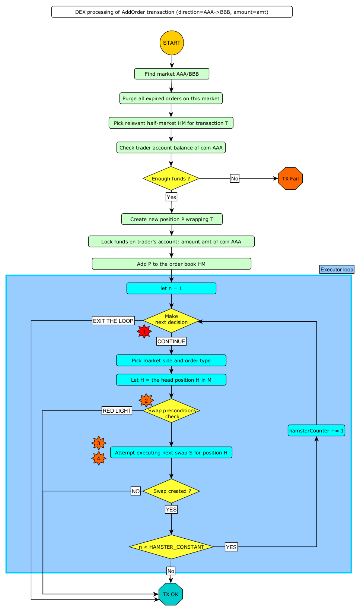

07. Executors
=============

As a DEX operates on top of a blockchain, it follows the basic principle of blockchains: there is a decentralized
ledger of transactions which validators are building. So, one can see a DEX as an evolving state of a sequential
computer.

As was explained in chapter 6, we fixed a certain set of transaction types and we fixed their semantics for all but one.
The single exceptional case being ``add-order`` transaction. On the technical level, a single ``add-order`` execution
must be resolved to a sequence of swaps. This is the job of an **executor**. We consider an executor to be pluggable
part of DEX implementation.

In this chapter we specify the algorithms of all executors currently supported in Dexter. The dynamic behaviour of these
algorithms and especially the comparative measurements of their statistics is the primary motivation behind creating
Dexter.

Space of executors research
---------------------------

In the current version of Dexter we limit our attention to certain natural space of most simplistic executors. Our
limiting conditions are:

**Rule #1: Equality of traders**
  Swaps chronology can depend only on the state of markets (i.e. it is not allowed that it depends on the state of
  traders).

  This rule means that the exchange in not "biased" on trader's identity or other trader properties (such as wealth
  for example).
  In lame terms it means that all traders are considered "equally important" by the executor - i.e. from the perspective
  of an executor, any trader is seen as "just an account number" (similar concept to "all citizens are considered equal
  by law in a democracy"). Current balance of trader's account, past history of trading operations and trader's name
  - all this cannot influence the path of DEX evolution that an executor is creating.

**Rule #2: Isolation of markets**
  Arrival of a new order generates swaps only on the market where this order belongs to.

**Rule #3: Isolation of traders**
  Every swap involves only one order.

**Rule #4: Isolation of swaps**
  An executor makes next-swap decision based only on the current state of the market and number of swaps executed in
  the current executor loop. The intention here is that the executor is not allowed to decide based on the history of
  executes swaps.

**Rule #5: Natural trading priority**
  Execution prioritizes traders happy to accept less attractive exchange rate (i.e. an exchange rate that gives him
  less profit). In case of a tie, a trader waiting longer is served first.

**Rule #6: Funds locking**
  Trader can place an order on the DEX only if the amount of tokens to be sold is covered by the balance of his
  account. Upon placing an order, the executor will issue a "lock" on the amount of tokens declared in the order
  as sell amount. Locked tokens cannot be reused in another order. Locked tokens get unlock on order expiration or
  cancellation.

Motivation for above rules comes from various sources:

  - **Equality of traders** and **Natural trading priority** seem to be very natual and go along the general
    expectations of the wide public; any DEX violating these rules would be really a weird one.
  - **Funds locking** is a business-level decision; DEXes violating this rule
    are probably quite useful and interesting, although it must be said that their trading mechanics would be more
    distant from Forex tradition. Therefore the motivation behind funds locking can be
    seen as "let's keep things mentally close to Forex community for now" (please notice that Dexter is all about
    simulating hybrid exchanges, so the analogy to Forex is going to be always around).
  - All 3 "isolation" rules delineate the boundary of "simplest executors one can consider"; anything beyond this region
    immediately becomes complex and sophisticated. From this perspective the mission of Dexter can be understood as
    "let's see how far we can get with those simplistic executors before we delve into sophisticated ones". A good
    motivation for dropping **isolation of markets** would be building a DEX where arbitrage is impossible. A good
    motivation for dropping **isolation of traders** would be borrowing from Forex the idea of direct trader-to-trader
    swaps, i.e. bypassing the AMM interaction when possible.

Executor loop overview
----------------------

Because we assume **Rule #2: Isolation of markets**, once a new order arrives to the DEX, we are going to process
the order book only for the market where the new order belongs. Let us fix the coins to be :math:`AAA` and :math:`BBB`,
so the market is :math:`AAA/BBB` and orders have direction :math:`AAA \rightarrow BBB` or
:math:`BBB \rightarrow AAA`. We will further refer to this market as ``market`` (see the scripts below).

Thanks to the rules enumerated in previous chapter, the job of an executor loop can be largely simplified. Let us
outline the template of such loop by extending the activity diagram in from previous chapter:

Places marked above with red asterisk are where non-trivial logic must be plugged-in:

**1: Half-market selection**
  At this point, one of two half-markets must be picked. This is equivalent to selecting a direction: :math:`AAA \rightarrow BBB`
  or :math:`BBB \rightarrow AAA`. In the context of "oriented" market, this means selecting "asks" or "bids" side
  of the order book.

**2: Swap preconditions**
  At this point swap preconditions are checked. Red light will abort swap creation and terminate the executor loop.

**3: Swap amounts**
  Deciding on amounts of the next swap to be executed. Because of **Rule #5: Natural trading priority**, the next swap
  to be executed must relate to the position at the head of the positions list (because the positions list is ordered
  by price-then-order-time.

**4: Executor loop termination**
  Deciding if the executor loop should continue or exit.

In the algorithms of the executor loop we outline below, ``pos`` is the just-added position. While defining a new swap,
``x`` is the amount of tokens received from AMM and ``y`` is the amount of tokens given to AMM.

We follow attributes
and methods as defined in the UML model.

Arithmetic precision problems and their solution
------------------------------------------------

Internal working of the executor is vulnerable to "strange" effects caused by imperfectness of computer arithmetic.
This effects generally disrupt the operation of mathematical definitions of the executor. Two particular problems are:

  1. When (at least one side of) the AMM balance becomes small enough, integer rounding effects can cause significant
     errors in calculated swap amounts.

  2. When calculated swap amounts are small enough, integer rounding may cause limit-price invariant to fail.

To avoid such anomalies we generally apply a simple approach:

  1. Enforce that AMM balances are always above certain AMM_MIN_BALANCE (which is a parameter).

  2. Enforce that order amount is always above certain TRADING_MIN_AMOUNT (which is a parameter).

  3. Enforce that swap amounts are always above certain SWAP_MIN_AMOUNT (which is a parameter).

To work as expected, above parameters must be set accordingly to the arithmetic precision used by the implementation
of DEX. Please notice that arithmetic precision is also limited in the fixed-point arithmetic - because of the
necessary rounding in operations such as multiplication.

For example if the arithmetic precision is at the order 1e-18, then "reasonable" values for above params could be:

  - AMM_MIN_BALANCE = 1e-14

  - TRADING_MIN_AMOUNT = 1e-8

  - SWAP_MIN_AMOUNT = 1e-10

For clarity of executor algorithms - as exposed in this chapter - all checks related to above conditions are not
included in the pseudo-code.

Variant 1: TEAL executor
------------------------

This executor is based on a proprietary algorithm created in Onomy Protocol. This executor follows this TLA+
specification:

https://github.com/onomyprotocol/specs/

On top of the specification we apply the "minimal trading balance" check on the AMM level. We just do not allow
either size of the liquidity pool to

1. Half-market selection
^^^^^^^^^^^^^^^^^^^^^^^^

We select the same half-market where ``pos`` belongs:

.. code:: scala

    private def limitBooksNextExecDecision(market: Market): Option[MarketSide] = {
        return pos.normalizedMarketSide
    }

2: Swap preconditions
^^^^^^^^^^^^^^^^^^^^^

.. code:: scala

    if (selectedHalfMarket.limitBook.isEmpty)
        return RED_LIGHT

    val limitHead: Position = selectedHalfMarket.limitBook.head
    val r: Fraction = limitHead.exchangeRate
    val a: FPNumber = market.ammBalanceOf(limitHead.order.askCoin)
    val b: FPNumber = market.ammBalanceOf(limitHead.order.bidCoin)
    val ammPrice: Fraction = Fraction(a, b)

    if (ammPrice <= r)
      return RED_LIGHT
    else {
      val maxBidAmt: FPNumber = (a - b * r) * ((r + 1).reciprocal)
      val strikeBidAmt: FPNumber = FPNumber.min(limitHead.outstandingAmount, maxBidAmt)
      val strikeAskAmt: FPNumber = strikeBidAmt * r
      if (strikeBidAmt > 0 && strikeAskAmt > 0)
        return GREEN_LIGHT
      else
        return RED_LIGHT
    }

3: Swap amounts
^^^^^^^^^^^^^^^

.. code:: scala

    val limitHead: Position = selectedHalfMarket.limitBook.head
    val r: Fraction = limitHead.exchangeRate
    val a: FPNumber = market.ammBalanceOf(limitHead.order.askCoin)
    val b: FPNumber = market.ammBalanceOf(limitHead.order.bidCoin)
    val ammPrice: Fraction = Fraction(a, b)
    val maxBidAmt: FPNumber = (a - b * r) * ((r + 1).reciprocal)
    val y: FPNumber = FPNumber.min(limitHead.outstandingAmount, maxBidAmt)
    val x: FPNumber = y * r

4: Executor loop termination
^^^^^^^^^^^^^^^^^^^^^^^^^^^^

We terminate unconditionally. This means that the executor loop has always only one iteration.

Variant 2: TURQUOISE executor
-----------------------------

This executor is based on the idea that we execute orders always using the limit price as declared in the order itself
- as long as the AMM-price allows to do so without sponsoring the trader. There is no trading fee, instead the DEX
makes money on the difference between AMM price vs limit price.

The executor loop has fixed number of iterations - defined by "hamster constant". At every iteration, the half market
selection is based on picking the one with bigger overhang.

Math derivation
^^^^^^^^^^^^^^^

We consider an execution of some limit order :math:`BBB \rightarrow AAA`, i.e. where BBB is the bid coin and AAA is the ask
coin. In effect of the execution, :math:`x:AAA` will be received from AMM and :math:`y:BBB` will be given to AMM. After
the execution, the new state of the AMM will be:

.. math::

    a-x: AAA, b+y: BBB

An order contains a declared limit price :math:`r`. The execution of an order is only allowed when :math:`ammprice \geq r`.

Additionally, we want to keep the constant conversion rate for every order and we want it to be equal to the declared
limit price. In other words we want the following condition to hold:

.. math::

    \frac{x}{y}=r

Let's assume that we have an order for which the condition :math:`ammprice \geq r` is true. We want to find the maximal
amount of swap which is possible.

For the maximal swap, the inequality will turn into equality, hence we will have:

.. math::

    ammprice = r

The ammprice after successful execution of the order will be:

.. math::

    ammprice = \frac{a-x}{b+y}

Effectively, we arrive to the following system of equations (where :math:`x` and :math:`y` are unknown):

.. math::

    \begin{cases}
    \dfrac{a-x}{b+y}=r\\
    \dfrac{x}{y}=r
    \end{cases}

Solving this leads to:

.. math::

    \begin{cases}
    x=\dfrac{a-br}{2}\\
    y=\dfrac{a-br}{2r}
    \end{cases}

1. Half-market selection
^^^^^^^^^^^^^^^^^^^^^^^^

.. code:: scala

  private var flipper: Boolean = false

  private def limitBooksNextExecDecision(market: Market): Option[MarketSide] = {
    if (market.limitOrderBookAsks.isEmpty && market.limitOrderBookBids.isEmpty)
      return None

    if (market.limitOrderBookBids.isEmpty)
      return Some(MarketSide.Asks)

    if (market.limitOrderBookAsks.isEmpty)
      return Some(MarketSide.Bids)

    val topBid: Fraction = market.limitOrderBookBids.head.normalizedLimitPrice
    val bottomAsk: Fraction = market.limitOrderBookAsks.head.normalizedLimitPrice
    val ammPrice: Fraction = market.currentPriceNormalized

    if (topBid <= ammPrice && ammPrice <= bottomAsk)
      return None

    if (bottomAsk < ammPrice && topBid <= ammPrice)
      return Some(MarketSide.Asks)

    if (topBid > ammPrice && bottomAsk >= ammPrice)
      return Some(MarketSide.Bids)

    val bidOverhang = topBid - ammPrice
    val askOverHang = ammPrice - bottomAsk

    if (bidOverhang > askOverHang)
      return Some(MarketSide.Bids)

    if (bidOverhang < askOverHang)
      return Some(MarketSide.Asks)

    //they are equal, so we pick one pointed by the flipper
    flipper = ! flipper
    flipper match {
      case true => return Some(MarketSide.Bids)
      case false => return Some(MarketSide.Asks)
    }
  }

2: Swap preconditions
^^^^^^^^^^^^^^^^^^^^^

.. code:: scala

    lazy val limitHead: Position = limitBook.head
    val a: BigInt = halfMarketBA.poolBalance.pips
    val b: BigInt = halfMarketAB.poolBalance.pips
    val r: Fraction = limitHead.exchangeRate
    val x: BigInt = r.numerator
    val y: BigInt = r.denominator

    val ammPrice: Fraction = market.currentPriceDirected(askCoin, bidCoin)

    if (ammPrice <= r)
      return RED_LIGHT

    val maxBidAmt: FPNumber = FPNumber((a * y - b * x) / (2 * x))
    val maxAmountOfBidCoinThatWillNotDrainAmmBelowMargin: FPNumber = (market.ammBalanceOf(askCoin) -  ammMinBalance) ** r.reciprocal
    val strikeBidAmt: FPNumber = FPNumber.min(FPNumber.min(limitHead.amount, maxBidAmt), maxAmountOfBidCoinThatWillNotDrainAmmBelowMargin)
    val strikeAskAmt: FPNumber = strikeBidAmt ** r

    if (strikeBidAmt > FPNumber.zero && strikeAskAmt > FPNumber.zero)
      return GREEN_LIGHT
    else
      return RED_LIGHT

3: Swap amounts
^^^^^^^^^^^^^^^

.. code:: scala

    lazy val limitHead: Position = limitBook.head
    val a: BigInt = halfMarketBA.poolBalance.pips
    val b: BigInt = halfMarketAB.poolBalance.pips
    val r: Fraction = limitHead.exchangeRate
    val x: BigInt = r.numerator
    val y: BigInt = r.denominator

    val ammPrice: Fraction = market.currentPriceDirected(askCoin, bidCoin)

    if (ammPrice <= r)
      return RED_LIGHT

    val maxBidAmt: FPNumber = FPNumber((a * y - b * x) / (2 * x))
    val maxAmountOfBidCoinThatWillNotDrainAmmBelowMargin: FPNumber = (market.ammBalanceOf(askCoin) -  ammMinBalance) * r.reciprocal
    val strikeBidAmt: FPNumber = FPNumber.min(FPNumber.min(limitHead.amount, maxBidAmt), maxAmountOfBidCoinThatWillNotDrainAmmBelowMargin)
    val strikeAskAmt: FPNumber = strikeBidAmt * r

    val y: FPNumber = FPNumber.min(limitHead.outstandingAmount, maxBidAmt)
    val x: FPNumber = y * r

4: Executor loop termination
^^^^^^^^^^^^^^^^^^^^^^^^^^^^

We terminate unconditionally. This means that the executor loop has always only one iteration.

Variant 3: UNISWAP_HYBRID executor
----------------------------------

Complications caused by finite precision
----------------------------------------

sfsdfs

